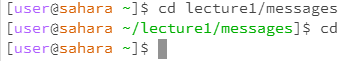
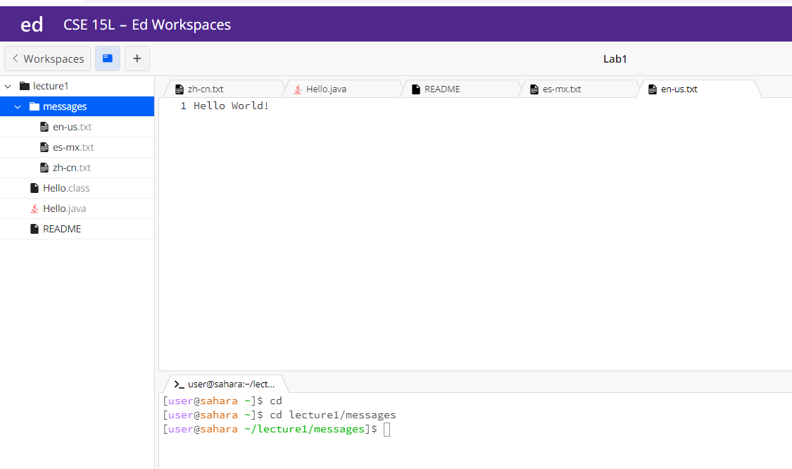

For __cd__ command
1. Share an example of using the command with no arguments
* screenshot of the command and its output 
    
* The working directory when command was run is /home.
* The cd command with no arguments takes the user from whatever path they are on before they use this command to home directory.
* No error for the output.   
   
2. Share an example of using the command with a path to a directory as an argument.
  * screenshot of the command and its output 
  
  * The working directory from /home changed to /home/lecture1/messages.
  * The cd command with a path to a directory as an argument changes whatever path the user is on before they use this command to the path that the user enters in this command.
  * No error for the output.  
   
  3. Share an example of using the command with a path to a file as an argument

