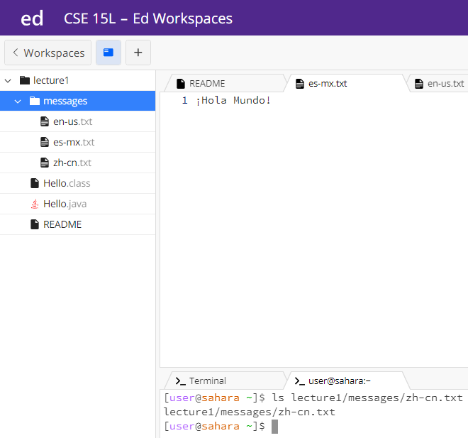
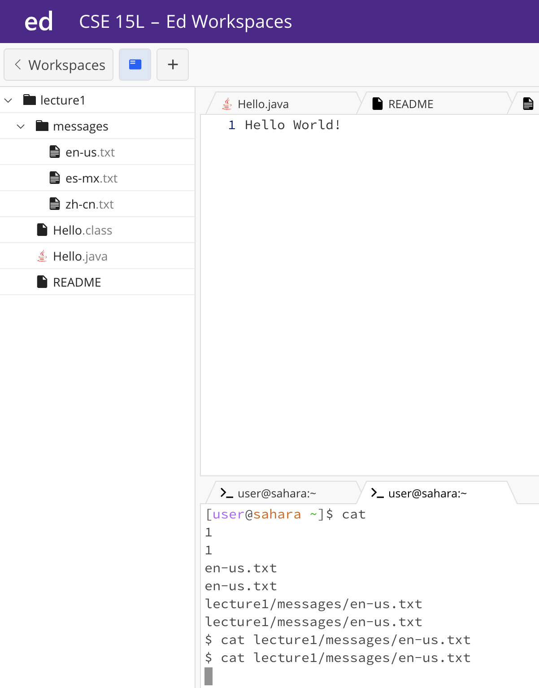
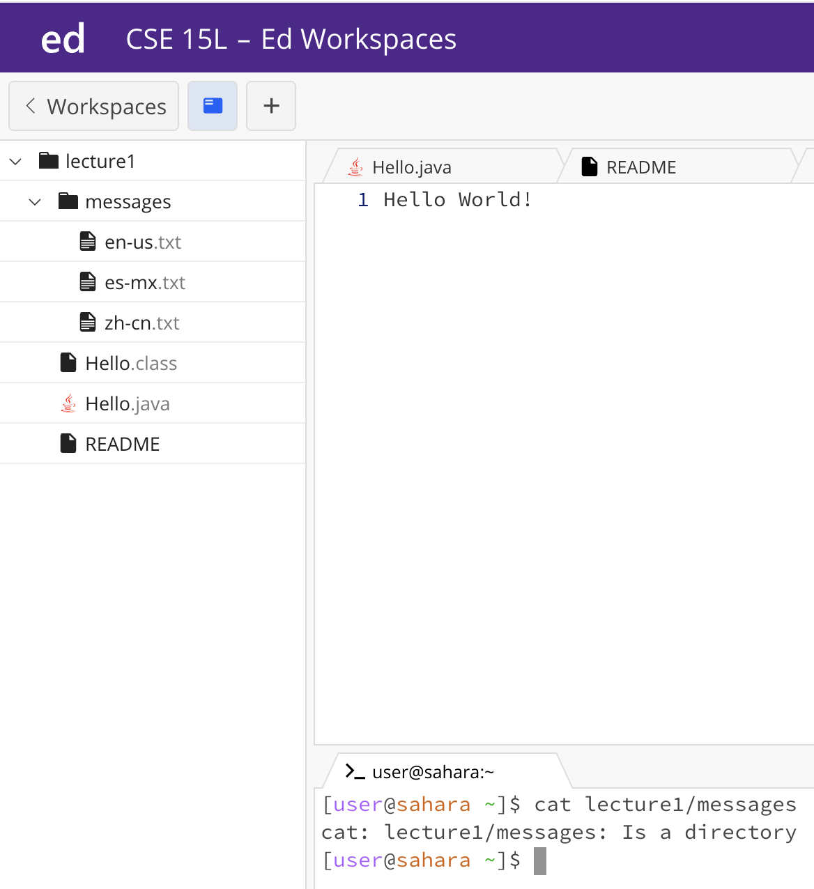
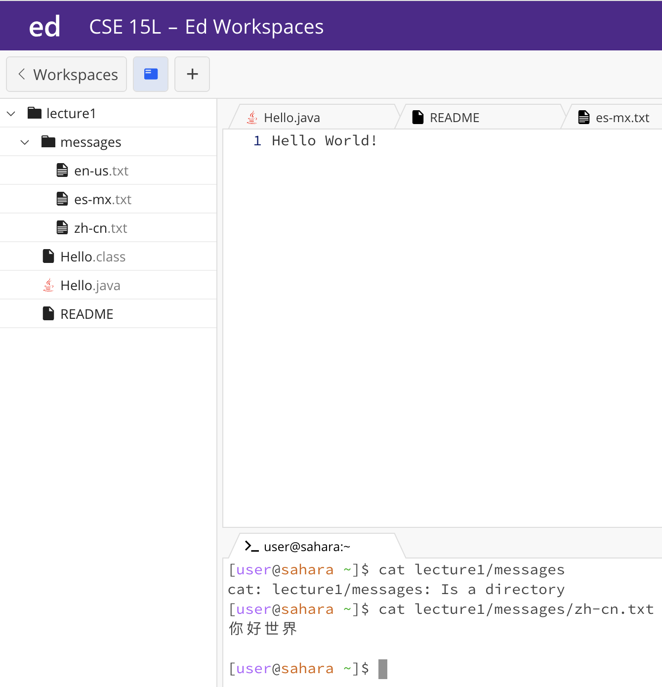

# For _cd_ command
1. Share an example of using the command with no arguments
* screenshot of the command and its output 
    
* The working directory when the command was run is /home.
* The cd command with no arguments takes the user from whatever path they are on before they use this command to home directory.
* No error for the output.   
   
2. Share an example of using the command with a path to a directory as an argument.
  * screenshot of the command and its output 
  
  * The working directory from /home changed to /home/lecture1/messages.
  * The cd command with a path to a directory as an argument changes whatever path the user is on before they use this command to the path that the user enters in this command.
  * No error for the output.  
     
 
3. Share an example of using the command with a path to a file as an argument.
* screenshot of the command and its output 

* The working directory when the command was run is /home
* Error message sent out says it is not a directory
* Output is an error, the reason that cd is that is used for changing directories, so it can not change the path to a file. 
 

# For _ls_ command
1. Share an example of using the command with no arguments
* screenshot of the command and its output 

* The working directory is whatever current path the user is on, in this case the working directory is /home/lecture1.
* The ls command with no arguments can list all the files and folders in the current path.
* No error for the output.

2. Share an example of using the command with a path to a directory as an argument.
* screenshot of the command and its output 

* The working directory is /home.
* The ls command with a path to a directory as an argument can list all the files and folders in the given path.
* No error for the output.  

3. Share an example of using the command with a path to a file as an argument.
* screenshot of the command and its output 

* The working directory is /home.
* The ls command with a path to a file as an argument will print out the path we just entered.
* No error for the output.

# For _cat_ command
1. Share an example of using the command with no arguments
* screenshot of the command and its output 

* The working directory for cat command with no arguments is /home.
* The cat command with no arguments will wait for the user to enter, and it will repeat what user entered.
* Output is an error because there is no path for cat command to search a file and print the contents.

2. Share an example of using the command with a path to a directory as an argument.
* screenshot of the command and its output 

* The working directory is /home.
* The cat command with a path to a directory as an argument will send an error message because cat command can only use the path to a file as an argument.
* Output is an error because the cat command is for the system to print the contents of one or more files given by the paths, it can only use for a path with files not directory.

3. Share an example of using the command with a path to a file as an argument.
* screenshot of the command and its output 

* The working directory is /home.
* The cat command with a path to a file as an argument will print the contents inside the file.
* No error for the output
    

   
